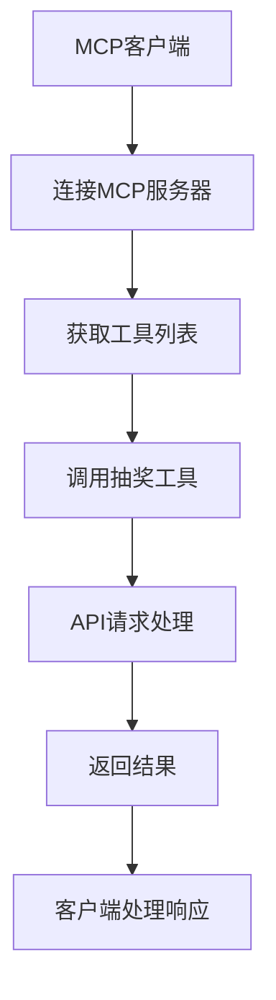

# Vibe Coding抽奖系统 MCP 服务器 - 产品需求文档

## 1. 产品概述

Vibe Coding抽奖系统 MCP 服务器是一个基于 Model Context Protocol 的工具服务器，为用户提供便捷的抽奖系统API调用能力。通过标准化的MCP工具接口，用户可以轻松管理用户资料、参与抽奖活动、查询抽奖结果和获取统计信息。

该MCP服务器将原有的REST API封装为MCP工具，使得AI助手和其他MCP客户端能够无缝集成抽奖系统功能，提供更好的用户体验和开发效率。

## 2. 核心功能

### 2.1 用户角色

| 角色 | 注册方式 | 核心权限 |
|------|----------|----------|
| MCP客户端用户 | 通过MCP连接配置 | 可调用所有抽奖系统工具，需要提供有效的Bearer Token |
| 系统管理员 | 服务器配置 | 可管理MCP服务器配置、监控工具调用状态 |

### 2.2 功能模块

我们的MCP服务器包含以下主要工具组：

1. **用户资料管理工具**: 用户信息上传、资料完整度查询
2. **抽奖参与工具**: 参与抽奖活动、获取参与状态
3. **抽奖查询工具**: 查询抽奖结果、获取历史记录
4. **活动管理工具**: 获取活动列表、查看活动详情
5. **统计分析工具**: 实时统计数据、趋势分析

### 2.3 页面详情

| 工具名称 | 模块名称 | 功能描述 |
|----------|----------|----------|
| upload_user_profile | 用户资料管理 | 上传用户的完整资料信息，包括基础信息、技能信息、社交信息等8个维度的数据 |
| participate_lottery | 抽奖参与 | 参与指定的抽奖活动，支持普通抽奖、技能挑战、创意比赛三种类型 |
| get_lottery_result | 抽奖结果查询 | 查询指定抽奖活动的结果，包括中奖者信息和活动状态 |
| get_user_history | 历史记录查询 | 获取用户的抽奖参与历史和中奖记录 |
| list_lottery_activities | 活动列表 | 获取当前可参与的抽奖活动列表 |
| get_lottery_stats | 统计分析 | 获取抽奖活动的实时统计信息和参与趋势 |

## 3. 核心流程

### MCP客户端调用流程

1. **连接建立**: MCP客户端连接到服务器，获取可用工具列表
2. **身份验证**: 客户端提供Bearer Token进行API调用授权
3. **工具调用**: 根据需要调用相应的抽奖系统工具
4. **结果返回**: 服务器返回API调用结果和状态信息

### 用户资料管理流程

1. **资料上传**: 使用upload_user_profile工具上传用户完整资料
2. **权重计算**: 系统自动计算用户资料完整度和抽奖权重
3. **资料更新**: 支持增量更新用户资料信息

### 抽奖参与流程

1. **活动查询**: 使用list_lottery_activities获取可参与的活动
2. **参与抽奖**: 使用participate_lottery参与指定活动
3. **结果查询**: 使用get_lottery_result查询抽奖结果
4. **历史记录**: 使用get_user_history查看参与历史

## 4. 用户界面设计

### 4.1 设计风格

- **主色调**: 蓝色系 (#2563EB) 和绿色系 (#059669) 体现专业性和成功感
- **辅助色**: 灰色系 (#6B7280) 用于次要信息显示
- **工具响应格式**: JSON结构化数据，便于程序化处理
- **错误处理**: 统一的错误码和消息格式
- **日志记录**: 详细的调用日志和性能监控

### 4.2 工具设计概览

| 工具名称 | 输入参数 | 输出格式 |
|----------|----------|----------|
| upload_user_profile | 用户ID、完整资料对象 | 成功状态、资料ID、完整度评分 |
| participate_lottery | 用户ID、抽奖ID、参与类型 | 参与ID、票号、中奖概率 |
| get_lottery_result | 抽奖ID | 活动状态、中奖者列表、统计信息 |
| get_user_history | 用户ID | 参与总数、中奖次数、历史记录 |
| list_lottery_activities | 无 | 活动列表、状态、奖品信息 |
| get_lottery_stats | 抽奖ID | 参与统计、趋势数据、贡献者排行 |

### 4.3 响应性

该MCP服务器设计为跨平台兼容，支持各种MCP客户端调用，包括命令行工具、AI助手、Web应用等。所有工具调用都采用异步处理，确保高并发场景下的稳定性。