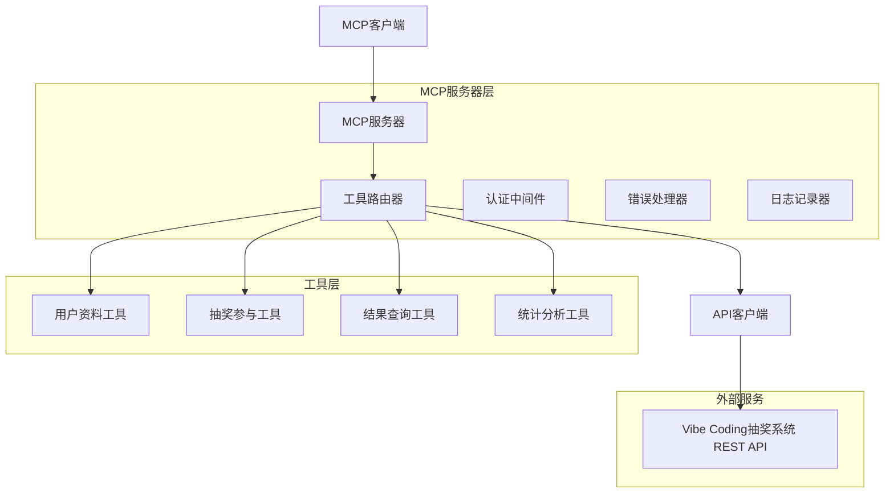
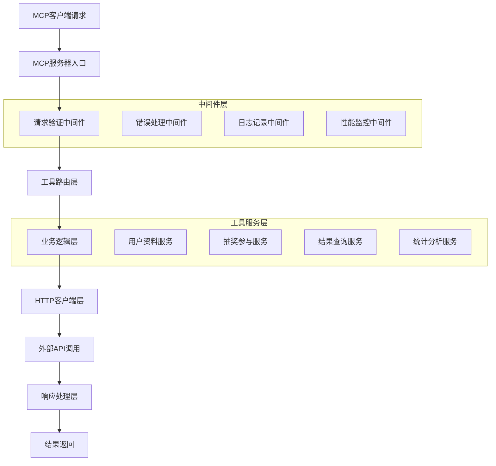
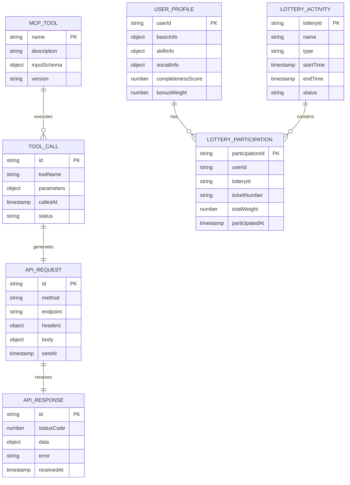

# Vibe Coding抽奖系统 MCP 服务器 - 技术架构文档

## 1. 架构设计



## 2. 技术描述

- 前端: MCP客户端 (支持各种MCP兼容应用)
- 后端: Node.js + TypeScript + @modelcontextprotocol/sdk
- HTTP客户端: axios
- 认证: Bearer Token传递
- 日志: winston
- 配置管理: dotenv

## 3. 工具定义

| 工具名称 | 用途 |
|----------|------|
| upload_user_profile | 上传用户完整资料信息到抽奖系统 |
| participate_lottery | 参与指定的抽奖活动 |
| get_lottery_result | 查询抽奖活动结果和中奖信息 |
| get_user_history | 获取用户抽奖参与历史记录 |
| list_lottery_activities | 获取当前可参与的抽奖活动列表 |
| get_lottery_stats | 获取抽奖活动的实时统计数据 |

## 4. API定义

### 4.1 核心工具接口

#### upload_user_profile
上传用户抽奖资料信息

输入参数:
| 参数名 | 参数类型 | 是否必需 | 描述 |
|--------|----------|----------|------|
| userId | string | true | 用户唯一标识符 |
| basicInfo | object | true | 基础信息对象 |
| skillInfo | object | true | 技能信息对象 |
| socialInfo | object | false | 社交信息对象 |
| interactionInfo | object | false | 互动信息对象 |
| creativeInfo | object | false | 创意信息对象 |
| contributionInfo | object | false | 贡献信息对象 |
| learningInfo | object | false | 学习信息对象 |
| investmentInfo | object | false | 投资信息对象 |
| bearerToken | string | true | API认证令牌 |

输出结果:
| 参数名 | 参数类型 | 描述 |
|--------|----------|------|
| success | boolean | 操作是否成功 |
| profileId | string | 资料档案ID |
| completeness | number | 资料完整度评分 |
| bonusWeight | number | 抽奖权重加成 |

#### participate_lottery
参与抽奖活动

输入参数:
| 参数名 | 参数类型 | 是否必需 | 描述 |
|--------|----------|----------|------|
| userId | string | true | 用户ID |
| lotteryId | string | true | 抽奖活动ID |
| participationType | string | true | 参与类型: normal/skill/creative |
| skillChallenge | string | false | 技能挑战答案 |
| creativeSubmission | string | false | 创意作品提交 |
| bearerToken | string | true | API认证令牌 |

输出结果:
| 参数名 | 参数类型 | 描述 |
|--------|----------|------|
| success | boolean | 参与是否成功 |
| participationId | string | 参与记录ID |
| ticketNumber | string | 抽奖票号 |
| winningProbability | number | 中奖概率 |

#### get_lottery_result
查询抽奖结果

输入参数:
| 参数名 | 参数类型 | 是否必需 | 描述 |
|--------|----------|----------|------|
| lotteryId | string | true | 抽奖活动ID |
| bearerToken | string | true | API认证令牌 |

输出结果:
| 参数名 | 参数类型 | 描述 |
|--------|----------|------|
| success | boolean | 查询是否成功 |
| lotteryId | string | 抽奖活动ID |
| status | string | 活动状态 |
| winners | array | 中奖者列表 |
| totalParticipants | number | 总参与人数 |
| drawTime | string | 开奖时间 |

#### get_user_history
获取用户抽奖历史

输入参数:
| 参数名 | 参数类型 | 是否必需 | 描述 |
|--------|----------|----------|------|
| userId | string | true | 用户ID |
| bearerToken | string | true | API认证令牌 |

输出结果:
| 参数名 | 参数类型 | 描述 |
|--------|----------|------|
| success | boolean | 查询是否成功 |
| totalParticipations | number | 总参与次数 |
| totalWins | number | 总中奖次数 |
| winRate | number | 中奖率 |
| history | array | 历史记录列表 |

#### list_lottery_activities
获取抽奖活动列表

输入参数:
| 参数名 | 参数类型 | 是否必需 | 描述 |
|--------|----------|----------|------|
| bearerToken | string | true | API认证令牌 |

输出结果:
| 参数名 | 参数类型 | 描述 |
|--------|----------|------|
| success | boolean | 查询是否成功 |
| activities | array | 活动列表 |

#### get_lottery_stats
获取抽奖统计信息

输入参数:
| 参数名 | 参数类型 | 是否必需 | 描述 |
|--------|----------|----------|------|
| lotteryId | string | true | 抽奖活动ID |
| bearerToken | string | true | API认证令牌 |

输出结果:
| 参数名 | 参数类型 | 描述 |
|--------|----------|------|
| success | boolean | 查询是否成功 |
| totalParticipants | number | 总参与人数 |
| averageWeight | number | 平均权重 |
| participationTrend | array | 参与趋势数据 |
| topContributors | array | 顶级贡献者列表 |

## 5. 服务器架构图



## 6. 数据模型

### 6.1 数据模型定义



### 6.2 TypeScript类型定义

```typescript
// MCP工具定义
interface MCPTool {
    name: string;
    description: string;
    inputSchema: {
        type: 'object';
        properties: Record<string, any>;
        required: string[];
    };
}

// 工具调用记录
interface ToolCall {
    id: string;
    toolName: string;
    parameters: Record<string, any>;
    calledAt: Date;
    status: 'pending' | 'success' | 'error';
    result?: any;
    error?: string;
}

// API请求配置
interface APIConfig {
    baseURL: string;
    timeout: number;
    headers: {
        'Content-Type': string;
        'Authorization'?: string;
    };
}

// 用户资料接口
interface UserProfileData {
    userId: string;
    basicInfo: BasicInfo;
    skillInfo: SkillInfo;
    socialInfo?: SocialInfo;
    interactionInfo?: InteractionInfo;
    creativeInfo?: CreativeInfo;
    contributionInfo?: ContributionInfo;
    learningInfo?: LearningInfo;
    investmentInfo?: InvestmentInfo;
}

// 抽奖参与数据
interface LotteryParticipationData {
    userId: string;
    lotteryId: string;
    participationType: 'normal' | 'skill' | 'creative';
    additionalData?: {
        skillChallenge?: string;
        creativeSubmission?: string;
    };
}

// API响应格式
interface APIResponse<T = any> {
    success: boolean;
    message?: string;
    data?: T;
    error?: {
        code: string;
        message: string;
        details?: any;
    };
}

// MCP服务器配置
interface MCPServerConfig {
    name: string;
    version: string;
    apiBaseURL: string;
    defaultTimeout: number;
    logLevel: 'debug' | 'info' | 'warn' | 'error';
    enableMetrics: boolean;
}
```