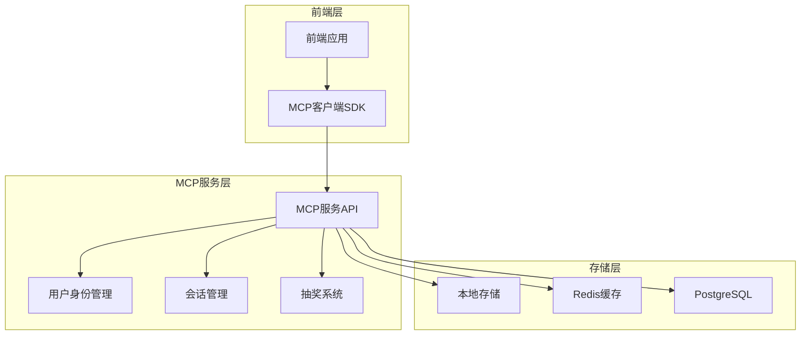

# VibeDoge MCP服务完整文档

## 目录

1. [项目概述](#1-项目概述)
2. [产品需求文档](#2-产品需求文档)
3. [技术架构设计](#3-技术架构设计)
4. [API接口规范](#4-api接口规范)
5. [开发指南](#5-开发指南)
6. [Vibe Coding抽奖系统集成](#6-vibe-coding抽奖系统集成)
7. [部署说明](#7-部署说明)
8. [MCP工具集成](#8-mcp工具集成)

---

## 1. 项目概述

### 1.1 项目定位

VibeDoge MCP (Model Context Protocol) 服务是一个创新的用户身份管理和上下文协议服务，专为VibeDoge交易所Demo版设计。该服务采用轻量级架构，提供免注册的流畅用户体验，同时集成Vibe Coding抽奖系统，为用户提供丰富的互动功能。

### 1.2 核心特性

- **免注册体验**: 自动生成用户ID，无需复杂注册流程
- **会话持久化**: 智能会话管理，支持跨设备同步
- **轻量级设计**: 最小化资源占用，快速响应
- **抽奖系统集成**: 完整的Vibe Coding抽奖功能
- **本地优先**: 支持本地存储，离线可用
- **跨平台兼容**: 支持Web、移动端等多平台

### 1.3 技术栈

**前端技术：**
- React 18+ with TypeScript
- Vite (构建工具)
- Tailwind CSS (样式框架)
- LocalStorage (本地存储)
- Fetch API (HTTP请求)

**后端技术：**
- Node.js >= 18.0.0
- Express (Web框架)
- TypeScript >= 5.0.0
- UUID (唯一标识符生成)
- JWT (会话令牌)
- Redis (缓存，可选)
- PostgreSQL (数据持久化，可选)

**开发工具：**
- pnpm (包管理器)
- ESLint (代码质量)
- Jest (单元测试)
- Docker (容器化)
- PM2 (进程管理)

---

## 2. 产品需求文档

### 2.1 产品概述

**项目名称**: VibeDoge MCP服务  
**项目类型**: 用户身份管理和上下文协议服务  
**目标用户**: VibeDoge交易所用户、Vibe Coding社区成员  
**核心价值**: 提供无缝的用户体验和丰富的社区互动功能

### 2.2 核心功能模块

#### 2.2.1 用户身份管理
- **自动用户生成**: 无需注册，自动创建用户身份
- **会话管理**: 智能会话维护和恢复
- **身份验证**: 基于令牌的安全验证
- **用户资料**: 支持个人信息和偏好设置

#### 2.2.2 MCP协议支持
- **上下文管理**: 维护用户交互上下文
- **工具集成**: 支持多种MCP工具
- **资源管理**: 统一资源访问接口
- **提示管理**: 智能提示和建议系统

#### 2.2.3 Vibe Coding抽奖系统
- **用户资料管理**: 6类用户资料上传和管理
- **智能抽奖算法**: 基于用户活跃度的权重计算
- **多样化抽奖**: 普通抽奖、技能挑战、创意比赛
- **实时统计**: 参与数据和中奖概率统计
- **防作弊机制**: 数据验证和质量评分

### 2.3 用户角色定义

#### 2.3.1 普通用户
- 自动获得用户身份
- 参与抽奖活动
- 管理个人资料
- 查看活动历史

#### 2.3.2 活跃用户
- 完善个人资料获得更高权重
- 参与技能挑战
- 贡献社区内容
- 享受优先权益

#### 2.3.3 开发者用户
- 集成MCP协议
- 使用开发工具
- 访问API接口
- 参与技术社区

### 2.4 核心业务流程

#### 2.4.1 用户首次访问流程
1. **自动识别**: 检测新用户访问
2. **生成身份**: 自动创建用户ID和会话
3. **本地存储**: 保存用户信息到本地
4. **引导体验**: 展示核心功能和抽奖活动

#### 2.4.2 抽奖参与流程
1. **资料完善**: 用户上传个人资料
2. **权重计算**: 系统计算用户权重
3. **参与抽奖**: 选择抽奖类型并参与
4. **结果查询**: 查看抽奖结果和历史

#### 2.4.3 会话恢复流程
1. **本地检测**: 检查本地存储的会话信息
2. **会话验证**: 验证会话有效性
3. **数据同步**: 同步最新用户数据
4. **状态恢复**: 恢复用户操作状态

---

## 3. 技术架构设计

### 3.1 整体架构



### 3.2 服务分层架构

| 层级 | 组件 | 职责 |
|------|------|------|
| 接入层 | MCP客户端SDK | 前端集成、API调用、本地存储管理 |
| 服务层 | MCP服务API | 用户管理、会话控制、抽奖逻辑 |
| 业务层 | 核心服务 | 身份验证、权重计算、数据处理 |
| 数据层 | 存储服务 | 用户数据持久化、会话缓存 |

### 3.3 核心组件设计

#### 3.3.1 MCP客户端SDK
```typescript
class MCPService {
  // 用户管理
  generateUserId(): string
  createUser(): Promise<MCPUser>
  updateUserProfile(profile: UserProfile): Promise<void>
  
  // 会话管理
  restoreFromStorage(): MCPUser | null
  heartbeat(): void
  clearSession(): void
  
  // 抽奖功能
  uploadUserProfile(profile: LotteryProfile): Promise<void>
  participateInLottery(lotteryId: string): Promise<ParticipationResult>
  getLotteryResults(lotteryId: string): Promise<LotteryResult>
  
  // 存储管理
  private saveToStorage(user: MCPUser): void
  private loadFromStorage(): MCPUser | null
}
```

#### 3.3.2 数据模型定义
```typescript
// 用户模型
interface MCPUser {
  id: string;           // 用户唯一标识
  createdAt: string;    // 创建时间
  lastActiveAt: string; // 最后活跃时间
  sessionToken: string; // 会话令牌
  profile?: UserProfile; // 用户资料
}

// 用户资料模型
interface UserProfile {
  nickname?: string;
  avatar?: string;
  preferences: Record<string, any>;
  lotteryProfile?: LotteryProfile;
}

// 抽奖资料模型
interface LotteryProfile {
  basicInfo: BasicInfo;
  skillInfo: SkillInfo;
  socialInfo: SocialInfo;
  interactionInfo: InteractionInfo;
  creativeInfo: CreativeInfo;
  contributionInfo: ContributionInfo;
  learningInfo: LearningInfo;
  investmentInfo: InvestmentInfo;
}
```

### 3.4 安全架构

#### 3.4.1 身份验证
- **JWT令牌**: 基于JSON Web Token的会话管理
- **令牌刷新**: 自动令牌刷新机制
- **权限控制**: 基于角色的访问控制

#### 3.4.2 数据安全
- **数据加密**: 敏感数据加密存储
- **传输安全**: HTTPS加密传输
- **输入验证**: 严格的输入数据验证

#### 3.4.3 防作弊机制
- **重复检测**: 防止重复参与抽奖
- **质量评分**: 用户资料质量评估
- **行为分析**: 异常行为检测

---

## 4. API接口规范

### 4.1 基础信息

- **Base URL**: `http://localhost:3001/api/mcp/v1`
- **协议**: HTTP (本地开发环境)
- **数据格式**: JSON
- **字符编码**: UTF-8
- **API版本**: v1.0.0
- **本地调试端口**: 3001

### 4.2 通用响应格式

```json
{
  "success": boolean,
  "data": object | array | null,
  "message": string,
  "timestamp": string,
  "requestId": string
}
```

### 4.3 错误响应格式

```json
{
  "success": false,
  "error": {
    "code": string,
    "message": string,
    "details": object
  },
  "timestamp": string,
  "requestId": string
}
```

### 4.4 用户管理接口

#### 4.4.1 生成用户ID

**接口信息**
- **URL**: `POST /users/generate`
- **描述**: 为新用户生成唯一标识符和会话令牌
- **认证**: 无需认证

**请求参数**
```json
{
  "deviceInfo": {
    "platform": "web",
    "userAgent": "Mozilla/5.0...",
    "language": "zh-CN",
    "timezone": "Asia/Shanghai"
  },
  "metadata": {
    "source": "vibedoge-demo",
    "version": "1.0.0"
  }
}
```

**响应示例**
```json
{
  "success": true,
  "data": {
    "user": {
      "id": "mcp_1704067200000_abc123def456",
      "createdAt": "2024-01-01T00:00:00.000Z",
      "lastActiveAt": "2024-01-01T00:00:00.000Z",
      "sessionToken": "xyz789uvw012pqr345stu678",
      "expiresAt": "2024-01-08T00:00:00.000Z"
    },
    "config": {
      "sessionDuration": 604800,
      "heartbeatInterval": 300,
      "features": ["lottery", "community", "stats"]
    }
  },
  "message": "用户创建成功",
  "timestamp": "2024-01-01T00:00:00.000Z",
  "requestId": "req_abc123def456"
}
```

#### 4.4.2 获取用户信息

**接口信息**
- **URL**: `GET /users/{userId}`
- **描述**: 获取指定用户的详细信息
- **认证**: 需要会话令牌

**请求头**
```
Authorization: Bearer {sessionToken}
X-User-ID: {userId}
```

**响应示例**
```json
{
  "success": true,
  "data": {
    "id": "mcp_1704067200000_abc123def456",
    "createdAt": "2024-01-01T00:00:00.000Z",
    "lastActiveAt": "2024-01-01T12:30:00.000Z",
    "status": "active",
    "profile": {
      "nickname": "VibeCoder",
      "avatar": "https://cdn.vibedoge.com/avatars/default.jpg",
      "preferences": {
        "language": "zh-CN",
        "theme": "auto"
      }
    },
    "stats": {
      "loginCount": 15,
      "lotteryParticipations": 3,
      "communityPosts": 7
    }
  },
  "message": "获取用户信息成功",
  "timestamp": "2024-01-01T12:30:00.000Z",
  "requestId": "req_def456ghi789"
}
```

### 4.5 会话管理接口

#### 4.5.1 验证会话

**接口信息**
- **URL**: `POST /sessions/validate`
- **描述**: 验证用户会话的有效性
- **认证**: 需要会话令牌

**请求参数**
```json
{
  "userId": "mcp_1704067200000_abc123def456",
  "sessionToken": "xyz789uvw012pqr345stu678"
}
```

**响应示例**
```json
{
  "success": true,
  "data": {
    "valid": true,
    "expiresAt": "2024-01-08T00:00:00.000Z",
    "refreshed": false
  },
  "message": "会话验证成功",
  "timestamp": "2024-01-01T12:30:00.000Z",
  "requestId": "req_session_validate"
}
```

### 4.6 抽奖系统接口

#### 4.6.1 上传用户抽奖资料

**接口信息**
- **URL**: `POST /lottery/user-profile`
- **描述**: 上传用户Vibe Coding抽奖相关信息
- **认证**: 需要会话令牌

**请求参数**
```json
{
  "userId": "string",
  "basicInfo": {
    "nickname": "string",
    "avatar": "string",
    "bio": "string",
    "location": "string",
    "birthYear": "number",
    "gender": "male|female|other",
    "occupation": "string",
    "interests": ["string"]
  },
  "skillInfo": {
    "programmingLanguages": ["JavaScript", "Python", "Go"],
    "techLevel": "beginner|intermediate|advanced|expert",
    "projectExperience": "string",
    "specialties": ["string"],
    "certifications": ["string"],
    "yearsOfExperience": "number",
    "frameworks": ["string"],
    "tools": ["string"]
  },
  "socialInfo": {
    "githubUrl": "string",
    "portfolioUrl": "string",
    "linkedinUrl": "string",
    "twitterHandle": "string",
    "discordId": "string",
    "telegramHandle": "string",
    "personalWebsite": "string",
    "blogUrl": "string"
  },
  "interactionInfo": {
    "wishContent": "string",
    "shareReason": "string",
    "referralCode": "string",
    "favoriteFeature": "string",
    "improvementSuggestion": "string",
    "communityContribution": "string",
    "helpfulContent": "string",
    "mentorshipOffer": "boolean"
  },
  "creativeInfo": {
    "lotterySlogan": "string",
    "luckyNumber": "number",
    "personalTags": ["string"],
    "motto": "string",
    "favoriteQuote": "string",
    "dreamProject": "string",
    "superpower": "string",
    "timeTravel": "string"
  },
  "contributionInfo": {
    "platformContribution": "number",
    "activityLevel": "low|medium|high",
    "reputationScore": "number",
    "communityRole": "string",
    "helpfulAnswers": "number",
    "tutorialsCreated": "number",
    "bugsReported": "number",
    "featureRequests": "number"
  },
  "learningInfo": {
    "currentLearning": ["string"],
    "completedCourses": ["string"],
    "readingList": ["string"],
    "learningGoals": ["string"],
    "skillsToImprove": ["string"],
    "mentors": ["string"],
    "learningStyle": "string",
    "knowledgeSharing": "boolean"
  },
  "investmentInfo": {
    "riskTolerance": "conservative|moderate|aggressive",
    "investmentExperience": "string",
    "favoriteTokens": ["string"],
    "tradingStrategy": "string",
    "portfolioSize": "small|medium|large",
    "investmentGoals": ["string"],
    "marketAnalysis": "string",
    "defiExperience": "boolean"
  }
}
```

**响应示例**
```json
{
  "success": true,
  "message": "用户信息上传成功",
  "data": {
    "profileId": "string",
    "completeness": "number",
    "bonusWeight": "number"
  }
}
```

#### 4.6.2 参与抽奖

**接口信息**
- **URL**: `POST /lottery/participate`
- **描述**: 用户参与指定Vibe Coding抽奖活动
- **认证**: 需要会话令牌

**请求参数**
```json
{
  "userId": "string",
  "lotteryId": "string",
  "participationType": "normal|skill|creative",
  "additionalData": {
    "skillChallenge": "string",
    "creativeSubmission": "string"
  }
}
```

**响应示例**
```json
{
  "success": true,
  "message": "参与Vibe Coding抽奖成功",
  "data": {
    "participationId": "string",
    "ticketNumber": "string",
    "winningProbability": "number"
  }
}
```

#### 4.6.3 查询抽奖结果

**接口信息**
- **URL**: `GET /lottery/result/{lotteryId}`
- **描述**: 查询指定Vibe Coding抽奖活动的结果
- **认证**: 需要会话令牌

**响应示例**
```json
{
  "success": true,
  "data": {
    "lotteryId": "string",
    "status": "pending|completed|cancelled",
    "winners": [
      {
        "userId": "string",
        "nickname": "string",
        "prize": "string",
        "winningTime": "string"
      }
    ],
    "totalParticipants": "number",
    "drawTime": "string"
  },
  "message": "查询抽奖结果成功",
  "timestamp": "2024-01-01T12:30:00.000Z",
  "requestId": "req_lottery_result"
}
```

---

## 5. 开发指南

### 5.1 环境要求

- **Node.js**: >= 18.0.0
- **pnpm**: >= 8.0.0 (推荐) 或 npm >= 9.0.0
- **TypeScript**: >= 5.0.0
- **操作系统**: macOS, Linux, Windows

### 5.2 项目初始化

#### 5.2.1 克隆项目
```bash
git clone https://github.com/chenxing3060/vibedoge-mcp.git
cd vibedoge-mcp
```

#### 5.2.2 安装依赖
```bash
# 使用 pnpm (推荐)
pnpm install

# 或使用 npm
npm install
```

#### 5.2.3 环境配置
```bash
# 复制环境变量模板
cp .env.example .env

# 编辑环境变量
vim .env
```

**环境变量说明：**
```bash
# API基础URL
VIBE_CODING_API_URL=http://localhost:3001/api/mcp/v1

# Bearer Token认证
VIBE_CODING_BEARER_TOKEN=your_bearer_token_here

# 日志配置
LOG_LEVEL=info
VERBOSE_LOGGING=false
```

### 5.3 本地开发

#### 5.3.1 启动开发服务器
```bash
# 开发模式
pnpm dev

# 或
npm run dev
```

#### 5.3.2 构建项目
```bash
# 构建生产版本
pnpm build

# 或
npm run build
```

#### 5.3.3 启动生产服务器
```bash
# 启动生产服务器
pnpm start

# 或
npm start
```

### 5.4 项目结构

```
vibedoge-mcp/
├── src/
│   ├── index.ts              # 主入口文件
│   ├── server.ts             # MCP服务器实现
│   ├── tools/                # MCP工具定义
│   │   ├── index.ts          # 工具导出
│   │   ├── upload-user-profile.ts
│   │   ├── participate-lottery.ts
│   │   ├── get-lottery-result.ts
│   │   ├── get-user-history.ts
│   │   ├── list-lottery-activities.ts
│   │   └── get-lottery-stats.ts
│   ├── services/             # 业务服务
│   │   ├── api-client.ts     # API客户端
│   │   ├── user-service.ts   # 用户服务
│   │   ├── session-service.ts # 会话服务
│   │   └── lottery-service.ts # 抽奖服务
│   ├── types/                # 类型定义
│   │   ├── index.ts          # 类型导出
│   │   ├── user.ts           # 用户类型
│   │   ├── session.ts        # 会话类型
│   │   └── lottery.ts        # 抽奖类型
│   └── utils/                # 工具函数
│       ├── logger.ts         # 日志工具
│       ├── validation.ts     # 数据验证
│       └── helpers.ts        # 辅助函数
├── dist/                     # 构建输出
├── tests/                    # 测试文件
├── docs/                     # 文档
├── .env.example              # 环境变量模板
├── package.json              # 项目配置
├── tsconfig.json             # TypeScript配置
└── README.md                 # 项目文档
```

### 5.5 核心开发指南

#### 5.5.1 用户管理服务

**自动用户生成**
```typescript
// src/services/user-service.ts
export class UserService {
  generateUserId(): string {
    const timestamp = Date.now();
    const randomId = Math.random().toString(36).substring(2, 15);
    return `mcp_${timestamp}_${randomId}`;
  }

  async createUser(deviceInfo: DeviceInfo): Promise<MCPUser> {
    const userId = this.generateUserId();
    const sessionToken = this.generateSessionToken();
    
    const user: MCPUser = {
      id: userId,
      createdAt: new Date().toISOString(),
      lastActiveAt: new Date().toISOString(),
      sessionToken,
      deviceInfo
    };

    // 保存到本地存储
    this.saveToLocalStorage(user);
    
    return user;
  }
}
```

**会话管理**
```typescript
// src/services/session-service.ts
export class SessionService {
  private readonly SESSION_DURATION = 7 * 24 * 60 * 60 * 1000; // 7天
  private readonly HEARTBEAT_INTERVAL = 5 * 60 * 1000; // 5分钟

  validateSession(sessionToken: string): boolean {
    const session = this.getSessionFromStorage(sessionToken);
    if (!session) return false;
    
    const now = Date.now();
    const expiresAt = new Date(session.expiresAt).getTime();
    
    return now < expiresAt;
  }

  refreshSession(sessionToken: string): string {
    if (!this.validateSession(sessionToken)) {
      throw new Error('Invalid session');
    }
    
    const newExpiresAt = new Date(Date.now() + this.SESSION_DURATION);
    this.updateSessionExpiry(sessionToken, newExpiresAt);
    
    return sessionToken;
  }
}
```

#### 5.5.2 抽奖权重计算算法

**权重计算核心逻辑**
```typescript
// src/services/lottery-service.ts
export class LotteryDrawService {
  calculateUserWeight(profile: LotteryProfile): number {
    let totalWeight = 1.0; // 基础权重
    
    // 各部分权重计算
    const basicScore = this.calculateSectionScore(profile.basicInfo, BASIC_INFO_WEIGHTS);
    const skillScore = this.calculateSectionScore(profile.skillInfo, SKILL_INFO_WEIGHTS);
    const socialScore = this.calculateSectionScore(profile.socialInfo, SOCIAL_INFO_WEIGHTS);
    const interactionScore = this.calculateSectionScore(profile.interactionInfo, INTERACTION_INFO_WEIGHTS);
    const creativeScore = this.calculateSectionScore(profile.creativeInfo, CREATIVE_INFO_WEIGHTS);
    const contributionScore = this.calculateSectionScore(profile.contributionInfo, CONTRIBUTION_INFO_WEIGHTS);
    const learningScore = this.calculateSectionScore(profile.learningInfo, LEARNING_INFO_WEIGHTS);
    const investmentScore = this.calculateSectionScore(profile.investmentInfo, INVESTMENT_INFO_WEIGHTS);
    
    // 加权求和
    totalWeight += basicScore * 0.15;
    totalWeight += skillScore * 0.20;
    totalWeight += socialScore * 0.15;
    totalWeight += interactionScore * 0.15;
    totalWeight += creativeScore * 0.10;
    totalWeight += contributionScore * 0.15;
    totalWeight += learningScore * 0.05;
    totalWeight += investmentScore * 0.05;
    
    // 质量加成
    const qualityBonus = this.calculateQualityBonus(profile);
    totalWeight *= (1 + qualityBonus);
    
    return Math.min(totalWeight, 10.0); // 最大权重限制
  }

  private calculateSectionScore(section: any, weights: Record<string, number>): number {
    let score = 0;
    let maxScore = 0;
    
    for (const [field, weight] of Object.entries(weights)) {
      maxScore += weight;
      
      if (section[field] !== undefined && section[field] !== null && section[field] !== '') {
        if (Array.isArray(section[field])) {
          // 数组类型：根据长度计算分数
          const arrayLength = section[field].length;
          score += Math.min(arrayLength / 3, 1) * weight; // 假设3个元素为满分
        } else if (typeof section[field] === 'string') {
          // 字符串类型：根据长度计算分数
          const stringLength = section[field].length;
          score += Math.min(stringLength / 50, 1) * weight; // 假设50个字符为满分
        } else if (typeof section[field] === 'number') {
          // 数字类型：标准化处理
          score += Math.min(section[field] / 10, 1) * weight;
        } else if (typeof section[field] === 'boolean') {
          // 布尔类型：true为满分
          score += section[field] ? weight : 0;
        } else {
          // 其他类型：有值即为满分
          score += weight;
        }
      }
    }
    
    return maxScore > 0 ? score / maxScore : 0;
  }

  private calculateQualityBonus(profile: LotteryProfile): number {
    let bonus = 0;
    
    // 完整性加成
    const completeness = this.calculateCompleteness(profile);
    bonus += completeness * 0.2; // 最多20%加成
    
    // 特殊字段加成
    if (profile.skillInfo?.certifications?.length > 0) bonus += 0.1;
    if (profile.socialInfo?.githubUrl) bonus += 0.1;
    if (profile.contributionInfo?.reputationScore > 100) bonus += 0.1;
    
    return Math.min(bonus, 0.5); // 最多50%加成
  }
}
```

#### 5.5.3 防作弊机制

**数据验证**
```typescript
// src/utils/validation.ts
export class ValidationService {
  validateUserProfile(profile: LotteryProfile): ValidationResult {
    const errors: string[] = [];
    const warnings: string[] = [];
    
    // 基础信息验证
    if (!profile.basicInfo?.nickname || profile.basicInfo.nickname.length < 2) {
      errors.push('昵称至少需要2个字符');
    }
    
    // URL格式验证
    if (profile.socialInfo?.githubUrl && !this.isValidUrl(profile.socialInfo.githubUrl)) {
      errors.push('GitHub URL格式不正确');
    }
    
    // 重复内容检测
    if (this.hasRepeatedContent(profile)) {
      warnings.push('检测到重复内容，可能影响权重计算');
    }
    
    return {
      isValid: errors.length === 0,
      errors,
      warnings,
      qualityScore: this.calculateQualityScore(profile)
    };
  }

  private hasRepeatedContent(profile: LotteryProfile): boolean {
    const allTexts = this.extractAllTexts(profile);
    const uniqueTexts = new Set(allTexts.filter(text => text.length > 10));
    return uniqueTexts.size < allTexts.length * 0.8;
  }
}
```

#### 5.5.4 测试指南

**单元测试**
```bash
# 运行所有测试
pnpm test

# 运行特定测试文件
pnpm test user-service.test.ts

# 运行测试并生成覆盖率报告
pnpm test:coverage
```

**API测试**
```bash
# 测试用户生成接口
curl -X POST http://localhost:3001/api/mcp/v1/users/generate \
  -H "Content-Type: application/json" \
  -d '{
    "deviceInfo": {
      "platform": "web",
      "userAgent": "Mozilla/5.0...",
      "language": "zh-CN"
    }
  }'

# 测试抽奖参与接口
curl -X POST http://localhost:3001/api/mcp/v1/lottery/participate \
  -H "Content-Type: application/json" \
  -H "Authorization: Bearer your_token_here" \
  -d '{
    "userId": "mcp_1704067200000_abc123def456",
    "lotteryId": "lottery_001",
    "participationType": "normal"
  }'
```

---

## 6. Vibe Coding抽奖系统集成

### 6.1 系统概述

Vibe Coding抽奖系统是VibeDoge MCP服务的核心功能模块，旨在为社区用户提供公平、透明、有趣的抽奖体验。系统采用智能权重算法，根据用户的活跃度、贡献度和资料完整度来计算中奖概率，鼓励用户积极参与社区建设。

### 6.2 核心功能

#### 6.2.1 多维度用户画像
- **基础信息**: 昵称、头像、个人简介、地理位置等
- **技能信息**: 编程语言、技术水平、项目经验、专业认证等
- **社交信息**: GitHub、作品集、LinkedIn、Twitter等社交媒体链接
- **互动信息**: 许愿内容、分享理由、推荐码、功能建议等
- **创意信息**: 抽奖口号、幸运数字、个人标签、座右铭等
- **贡献信息**: 平台贡献度、活跃等级、声誉分数、社区角色等
- **学习信息**: 当前学习内容、完成课程、阅读清单、学习目标等
- **投资信息**: 风险偏好、投资经验、偏好代币、交易策略等

#### 6.2.2 智能权重算法
- **多维度评分**: 8个维度综合评估用户价值
- **动态权重**: 根据用户行为实时调整权重
- **质量加成**: 高质量内容获得额外权重加成
- **防作弊机制**: 检测和防止恶意刷权重行为

#### 6.2.3 多样化抽奖类型
- **普通抽奖**: 基于权重的随机抽奖
- **技能挑战**: 需要完成特定技能任务
- **创意比赛**: 提交创意作品参与评选
- **社区贡献**: 奖励活跃的社区贡献者

### 6.3 数据库设计

#### 6.3.1 用户资料表 (user_profiles)
```sql
CREATE TABLE user_profiles (
  id UUID PRIMARY KEY DEFAULT gen_random_uuid(),
  user_id VARCHAR(255) NOT NULL UNIQUE,
  basic_info JSONB,
  skill_info JSONB,
  social_info JSONB,
  interaction_info JSONB,
  creative_info JSONB,
  contribution_info JSONB,
  learning_info JSONB,
  investment_info JSONB,
  completeness_score DECIMAL(5,2) DEFAULT 0,
  quality_score DECIMAL(5,2) DEFAULT 0,
  total_weight DECIMAL(8,4) DEFAULT 1.0,
  created_at TIMESTAMP WITH TIME ZONE DEFAULT NOW(),
  updated_at TIMESTAMP WITH TIME ZONE DEFAULT NOW()
);
```

#### 6.3.2 抽奖活动表 (lottery_activities)
```sql
CREATE TABLE lottery_activities (
  id UUID PRIMARY KEY DEFAULT gen_random_uuid(),
  title VARCHAR(255) NOT NULL,
  description TEXT,
  type VARCHAR(50) NOT NULL, -- 'normal', 'skill', 'creative'
  status VARCHAR(50) DEFAULT 'active', -- 'active', 'completed', 'cancelled'
  start_time TIMESTAMP WITH TIME ZONE,
  end_time TIMESTAMP WITH TIME ZONE,
  draw_time TIMESTAMP WITH TIME ZONE,
  max_participants INTEGER,
  prizes JSONB, -- 奖品信息
  rules JSONB, -- 抽奖规则
  created_at TIMESTAMP WITH TIME ZONE DEFAULT NOW(),
  updated_at TIMESTAMP WITH TIME ZONE DEFAULT NOW()
);
```

#### 6.3.3 参与记录表 (lottery_participations)
```sql
CREATE TABLE lottery_participations (
  id UUID PRIMARY KEY DEFAULT gen_random_uuid(),
  lottery_id UUID REFERENCES lottery_activities(id),
  user_id VARCHAR(255) NOT NULL,
  participation_type VARCHAR(50) NOT NULL,
  user_weight DECIMAL(8,4) DEFAULT 1.0,
  ticket_number VARCHAR(100),
  additional_data JSONB,
  status VARCHAR(50) DEFAULT 'active', -- 'active', 'winner', 'loser'
  created_at TIMESTAMP WITH TIME ZONE DEFAULT NOW(),
  UNIQUE(lottery_id, user_id)
);
```

#### 6.3.4 抽奖结果表 (lottery_results)
```sql
CREATE TABLE lottery_results (
  id UUID PRIMARY KEY DEFAULT gen_random_uuid(),
  lottery_id UUID REFERENCES lottery_activities(id),
  user_id VARCHAR(255) NOT NULL,
  prize_info JSONB,
  winning_time TIMESTAMP WITH TIME ZONE DEFAULT NOW(),
  claimed BOOLEAN DEFAULT FALSE,
  claim_time TIMESTAMP WITH TIME ZONE
);
```

### 6.4 权重计算算法

#### 6.4.1 算法概述
权重计算采用多维度评分模型，每个维度都有相应的权重系数，最终通过加权求和得到用户的总权重。算法设计原则：
- **公平性**: 确保所有用户都有基础中奖机会
- **激励性**: 鼓励用户完善资料和积极参与
- **防作弊**: 检测和防止恶意刷权重行为
- **可扩展**: 支持动态调整权重规则

#### 6.4.2 权重配置
```typescript
// 各维度权重配置
const DIMENSION_WEIGHTS = {
  basicInfo: 0.15,      // 基础信息权重
  skillInfo: 0.20,      // 技能信息权重
  socialInfo: 0.15,     // 社交信息权重
  interactionInfo: 0.15, // 互动信息权重
  creativeInfo: 0.10,   // 创意信息权重
  contributionInfo: 0.15, // 贡献信息权重
  learningInfo: 0.05,   // 学习信息权重
  investmentInfo: 0.05  // 投资信息权重
};

// 基础信息字段权重
const BASIC_INFO_WEIGHTS = {
  nickname: 1.0,
  avatar: 1.0,
  bio: 2.0,
  location: 1.0,
  birthYear: 0.5,
  gender: 0.5,
  occupation: 1.5,
  interests: 2.0
};

// 技能信息字段权重
const SKILL_INFO_WEIGHTS = {
  programmingLanguages: 3.0,
  techLevel: 2.0,
  projectExperience: 3.0,
  specialties: 2.0,
  certifications: 2.5,
  yearsOfExperience: 1.5,
  frameworks: 2.0,
  tools: 1.5
};
```

#### 6.4.3 核心算法实现
```typescript
export class LotteryDrawService {
  /**
   * 计算用户总权重
   */
  calculateUserWeight(profile: LotteryProfile): number {
    let totalWeight = 1.0; // 基础权重，确保所有用户都有基础中奖机会
    
    // 计算各维度得分
    const scores = {
      basic: this.calculateSectionScore(profile.basicInfo, BASIC_INFO_WEIGHTS),
      skill: this.calculateSectionScore(profile.skillInfo, SKILL_INFO_WEIGHTS),
      social: this.calculateSectionScore(profile.socialInfo, SOCIAL_INFO_WEIGHTS),
      interaction: this.calculateSectionScore(profile.interactionInfo, INTERACTION_INFO_WEIGHTS),
      creative: this.calculateSectionScore(profile.creativeInfo, CREATIVE_INFO_WEIGHTS),
      contribution: this.calculateSectionScore(profile.contributionInfo, CONTRIBUTION_INFO_WEIGHTS),
      learning: this.calculateSectionScore(profile.learningInfo, LEARNING_INFO_WEIGHTS),
      investment: this.calculateSectionScore(profile.investmentInfo, INVESTMENT_INFO_WEIGHTS)
    };
    
    // 加权求和
    totalWeight += scores.basic * DIMENSION_WEIGHTS.basicInfo;
    totalWeight += scores.skill * DIMENSION_WEIGHTS.skillInfo;
    totalWeight += scores.social * DIMENSION_WEIGHTS.socialInfo;
    totalWeight += scores.interaction * DIMENSION_WEIGHTS.interactionInfo;
    totalWeight += scores.creative * DIMENSION_WEIGHTS.creativeInfo;
    totalWeight += scores.contribution * DIMENSION_WEIGHTS.contributionInfo;
    totalWeight += scores.learning * DIMENSION_WEIGHTS.learningInfo;
    totalWeight += scores.investment * DIMENSION_WEIGHTS.investmentInfo;
    
    // 质量加成
    const qualityBonus = this.calculateQualityBonus(profile);
    totalWeight *= (1 + qualityBonus);
    
    // 权重上限限制，防止权重过高
    return Math.min(totalWeight, 10.0);
  }

  /**
   * 计算单个维度得分
   */
  private calculateSectionScore(section: any, weights: Record<string, number>): number {
    if (!section) return 0;
    
    let score = 0;
    let maxScore = 0;
    
    for (const [field, weight] of Object.entries(weights)) {
      maxScore += weight;
      
      const value = section[field];
      if (this.hasValue(value)) {
        score += this.calculateFieldScore(value, weight);
      }
    }
    
    return maxScore > 0 ? score / maxScore : 0;
  }

  /**
   * 计算单个字段得分
   */
  private calculateFieldScore(value: any, weight: number): number {
    if (Array.isArray(value)) {
      // 数组类型：根据长度和内容质量计算
      const length = value.filter(item => item && item.toString().trim()).length;
      const lengthScore = Math.min(length / 3, 1); // 假设3个有效元素为满分
      const qualityScore = this.calculateArrayQuality(value);
      return lengthScore * qualityScore * weight;
    }
    
    if (typeof value === 'string') {
      // 字符串类型：根据长度和内容质量计算
      const trimmed = value.trim();
      if (!trimmed) return 0;
      
      const lengthScore = Math.min(trimmed.length / 50, 1); // 假设50个字符为满分
      const qualityScore = this.calculateStringQuality(trimmed);
      return lengthScore * qualityScore * weight;
    }
    
    if (typeof value === 'number') {
      // 数字类型：标准化处理
      return Math.min(Math.abs(value) / 10, 1) * weight;
    }
    
    if (typeof value === 'boolean') {
      // 布尔类型：true为满分
      return value ? weight : 0;
    }
    
    // 其他类型：有值即为满分
    return weight;
  }

  /**
   * 计算质量加成
   */
  private calculateQualityBonus(profile: LotteryProfile): number {
    let bonus = 0;
    
    // 完整性加成：资料越完整，加成越高
    const completeness = this.calculateCompleteness(profile);
    bonus += completeness * 0.2; // 最多20%加成
    
    // 特殊字段加成
    if (profile.skillInfo?.certifications?.length > 0) {
      bonus += 0.05; // 有认证证书
    }
    
    if (profile.socialInfo?.githubUrl && this.isValidGithubUrl(profile.socialInfo.githubUrl)) {
      bonus += 0.05; // 有效的GitHub链接
    }
    
    if (profile.contributionInfo?.reputationScore > 100) {
      bonus += 0.1; // 高声誉分数
    }
    
    if (profile.skillInfo?.yearsOfExperience > 5) {
      bonus += 0.05; // 丰富的工作经验
    }
    
    // 内容原创性加成
    const originalityBonus = this.calculateOriginalityBonus(profile);
    bonus += originalityBonus;
    
    return Math.min(bonus, 0.5); // 最多50%加成
  }

  /**
   * 计算资料完整性
   */
  private calculateCompleteness(profile: LotteryProfile): number {
    const sections = [
      profile.basicInfo,
      profile.skillInfo,
      profile.socialInfo,
      profile.interactionInfo,
      profile.creativeInfo,
      profile.contributionInfo,
      profile.learningInfo,
      profile.investmentInfo
    ];
    
    let totalFields = 0;
    let filledFields = 0;
    
    sections.forEach(section => {
      if (section) {
        Object.values(section).forEach(value => {
          totalFields++;
          if (this.hasValue(value)) {
            filledFields++;
          }
        });
      }
    });
    
    return totalFields > 0 ? filledFields / totalFields : 0;
  }

  /**
   * 检查是否有有效值
   */
  private hasValue(value: any): boolean {
    if (value === null || value === undefined) return false;
    if (typeof value === 'string') return value.trim().length > 0;
    if (Array.isArray(value)) return value.length > 0 && value.some(item => this.hasValue(item));
    if (typeof value === 'number') return !isNaN(value);
    return true;
  }

  /**
   * 计算字符串内容质量
   */
  private calculateStringQuality(text: string): number {
    let quality = 1.0;
    
    // 检查是否为重复字符
    if (this.isRepeatedText(text)) {
      quality *= 0.3;
    }
    
    // 检查是否包含有意义的内容
    if (this.hasMeaningfulContent(text)) {
      quality *= 1.2;
    }
    
    // 检查长度合理性
    if (text.length < 5) {
      quality *= 0.5;
    } else if (text.length > 200) {
      quality *= 0.8;
    }
    
    return Math.min(quality, 1.0);
  }

  /**
   * 计算数组内容质量
   */
  private calculateArrayQuality(array: any[]): number {
    if (array.length === 0) return 0;
    
    const uniqueItems = new Set(array.map(item => item?.toString()?.toLowerCase()?.trim()));
    const uniqueRatio = uniqueItems.size / array.length;
    
    // 去重后的比例作为质量指标
    return Math.max(uniqueRatio, 0.3); // 最低30%质量
  }

  /**
   * 计算原创性加成
   */
  private calculateOriginalityBonus(profile: LotteryProfile): number {
    // 检查是否有模板化内容
    const allTexts = this.extractAllTexts(profile);
    const templateTexts = ['请填写', '待补充', 'TODO', 'N/A', '无', '暂无'];
    
    const templateCount = allTexts.filter(text => 
      templateTexts.some(template => 
        text.toLowerCase().includes(template.toLowerCase())
      )
    ).length;
    
    const templateRatio = allTexts.length > 0 ? templateCount / allTexts.length : 0;
    
    // 模板内容越少，原创性加成越高
    return (1 - templateRatio) * 0.1; // 最多10%原创性加成
  }

  /**
   * 提取所有文本内容
   */
  private extractAllTexts(profile: LotteryProfile): string[] {
    const texts: string[] = [];
    
    const extractFromObject = (obj: any) => {
      if (typeof obj === 'string') {
        texts.push(obj);
      } else if (Array.isArray(obj)) {
        obj.forEach(item => extractFromObject(item));
      } else if (obj && typeof obj === 'object') {
        Object.values(obj).forEach(value => extractFromObject(value));
      }
    };
    
    extractFromObject(profile);
    return texts.filter(text => text && text.trim().length > 0);
  }

  /**
   * 检查是否为重复文本
   */
  private isRepeatedText(text: string): boolean {
    if (text.length < 10) return false;
    
    // 检查字符重复
    const chars = text.split('');
    const uniqueChars = new Set(chars);
    if (uniqueChars.size < chars.length * 0.3) return true;
    
    // 检查单词重复
    const words = text.split(/\s+/);
    const uniqueWords = new Set(words.map(w => w.toLowerCase()));
    if (uniqueWords.size < words.length * 0.5) return true;
    
    return false;
  }

  /**
   * 检查是否包含有意义的内容
   */
  private hasMeaningfulContent(text: string): boolean {
    // 检查是否包含技术关键词、具体描述等
    const meaningfulPatterns = [
      /\b(javascript|python|react|vue|node|typescript|java|go|rust|swift)\b/i,
      /\b(github|portfolio|project|experience|skill|certification)\b/i,
      /\b(开发|编程|技术|项目|经验|学习|贡献)\b/,
      /\d+年?/,
      /@\w+/,
      /https?:\/\//
    ];
    
    return meaningfulPatterns.some(pattern => pattern.test(text));
  }

  /**
   * 验证GitHub URL
   */
  private isValidGithubUrl(url: string): boolean {
    const githubPattern = /^https?:\/\/(www\.)?github\.com\/[a-zA-Z0-9_-]+\/?$/;
    return githubPattern.test(url);
  }
}
```

---

## 7. 部署说明

### 7.1 本地开发部署

#### 7.1.1 环境准备
```bash
# 确保Node.js版本
node --version  # 应该 >= 18.0.0

# 安装pnpm（推荐）
npm install -g pnpm

# 或者使用npm
npm --version  # 应该 >= 9.0.0
```

#### 7.1.2 项目启动
```bash
# 克隆项目
git clone https://github.com/chenxing3060/vibedoge-mcp.git
cd vibedoge-mcp

# 安装依赖
pnpm install

# 配置环境变量
cp .env.example .env
vim .env

# 启动开发服务器
pnpm dev
```

#### 7.1.3 验证部署
```bash
# 检查服务状态
curl http://localhost:3001/health

# 测试API接口
curl -X POST http://localhost:3001/api/mcp/v1/users/generate \
  -H "Content-Type: application/json" \
  -d '{"deviceInfo":{"platform":"web"}}'
```

### 7.2 Docker部署

#### 7.2.1 Dockerfile
```dockerfile
# 使用官方Node.js镜像
FROM node:18-alpine

# 设置工作目录
WORKDIR /app

# 安装pnpm
RUN npm install -g pnpm

# 复制package文件
COPY package.json pnpm-lock.yaml ./

# 安装依赖
RUN pnpm install --frozen-lockfile

# 复制源代码
COPY . .

# 构建项目
RUN pnpm build

# 暴露端口
EXPOSE 3001

# 启动应用
CMD ["pnpm", "start"]
```

#### 7.2.2 docker-compose.yml
```yaml
version: '3.8'

services:
  vibedoge-mcp:
    build: .
    ports:
      - "3001:3001"
    environment:
      - NODE_ENV=production
      - VIBE_CODING_API_URL=http://localhost:3001/api/mcp/v1
      - LOG_LEVEL=info
    volumes:
      - ./logs:/app/logs
    restart: unless-stopped
    healthcheck:
      test: ["CMD", "curl", "-f", "http://localhost:3001/health"]
      interval: 30s
      timeout: 10s
      retries: 3

  redis:
    image: redis:7-alpine
    ports:
      - "6379:6379"
    volumes:
      - redis_data:/data
    restart: unless-stopped

  postgres:
    image: postgres:15-alpine
    environment:
      - POSTGRES_DB=vibedoge_mcp
      - POSTGRES_USER=vibedoge
      - POSTGRES_PASSWORD=your_password_here
    ports:
      - "5432:5432"
    volumes:
      - postgres_data:/var/lib/postgresql/data
    restart: unless-stopped

volumes:
  redis_data:
  postgres_data:
```

#### 7.2.3 部署命令
```bash
# 构建并启动服务
docker-compose up -d

# 查看服务状态
docker-compose ps

# 查看日志
docker-compose logs -f vibedoge-mcp

# 停止服务
docker-compose down
```

### 7.3 生产环境部署

#### 7.3.1 服务器配置
```bash
# 更新系统
sudo apt update && sudo apt upgrade -y

# 安装Docker
curl -fsSL https://get.docker.com -o get-docker.sh
sudo sh get-docker.sh

# 安装Docker Compose
sudo curl -L "https://github.com/docker/compose/releases/download/v2.20.0/docker-compose-$(uname -s)-$(uname -m)" -o /usr/local/bin/docker-compose
sudo chmod +x /usr/local/bin/docker-compose

# 安装Nginx
sudo apt install nginx -y
```

#### 7.3.2 Nginx配置
```nginx
# /etc/nginx/sites-available/vibedoge-mcp
server {
    listen 80;
    server_name your-domain.com;
    
    # 重定向到HTTPS
    return 301 https://$server_name$request_uri;
}

server {
    listen 443 ssl http2;
    server_name your-domain.com;
    
    # SSL证书配置
    ssl_certificate /path/to/your/certificate.crt;
    ssl_certificate_key /path/to/your/private.key;
    
    # SSL安全配置
    ssl_protocols TLSv1.2 TLSv1.3;
    ssl_ciphers ECDHE-RSA-AES256-GCM-SHA512:DHE-RSA-AES256-GCM-SHA512:ECDHE-RSA-AES256-GCM-SHA384:DHE-RSA-AES256-GCM-SHA384;
    ssl_prefer_server_ciphers off;
    
    # 反向代理到MCP服务
    location /api/mcp/ {
        proxy_pass http://localhost:3001;
        proxy_http_version 1.1;
        proxy_set_header Upgrade $http_upgrade;
        proxy_set_header Connection 'upgrade';
        proxy_set_header Host $host;
        proxy_set_header X-Real-IP $remote_addr;
        proxy_set_header X-Forwarded-For $proxy_add_x_forwarded_for;
        proxy_set_header X-Forwarded-Proto $scheme;
        proxy_cache_bypass $http_upgrade;
    }
    
    # 健康检查
    location /health {
        proxy_pass http://localhost:3001/health;
        access_log off;
    }
    
    # 安全头
    add_header X-Frame-Options "SAMEORIGIN" always;
    add_header X-XSS-Protection "1; mode=block" always;
    add_header X-Content-Type-Options "nosniff" always;
    add_header Referrer-Policy "no-referrer-when-downgrade" always;
    add_header Content-Security-Policy "default-src 'self' http: https: data: blob: 'unsafe-inline'" always;
}
```

#### 7.3.3 PM2进程管理
```bash
# 安装PM2
npm install -g pm2

# PM2配置文件 ecosystem.config.js
module.exports = {
  apps: [{
    name: 'vibedoge-mcp',
    script: 'dist/index.js',
    instances: 'max',
    exec_mode: 'cluster',
    env: {
      NODE_ENV: 'production',
      PORT: 3001,
      VIBE_CODING_API_URL: 'https://your-domain.com/api/mcp/v1'
    },
    error_file: './logs/err.log',
    out_file: './logs/out.log',
    log_file: './logs/combined.log',
    time: true
  }]
};

# 启动应用
pm2 start ecosystem.config.js

# 保存PM2配置
pm2 save

# 设置开机自启
pm2 startup
```

### 7.4 监控和维护

#### 7.4.1 日志管理
```bash
# 查看应用日志
pm2 logs vibedoge-mcp

# 查看错误日志
tail -f logs/err.log

# 日志轮转配置
sudo vim /etc/logrotate.d/vibedoge-mcp
```

#### 7.4.2 性能监控
```bash
# 安装监控工具
npm install -g pm2-logrotate
npm install -g @pm2/io

# 启用监控
pm2 install pm2-server-monit
```

#### 7.4.3 备份策略
```bash
# 数据库备份脚本
#!/bin/bash
BACKUP_DIR="/backup/vibedoge-mcp"
DATE=$(date +%Y%m%d_%H%M%S)

# 创建备份目录
mkdir -p $BACKUP_DIR

# 备份PostgreSQL
docker exec postgres pg_dump -U vibedoge vibedoge_mcp > $BACKUP_DIR/db_$DATE.sql

# 备份Redis
docker exec redis redis-cli BGSAVE
docker cp redis:/data/dump.rdb $BACKUP_DIR/redis_$DATE.rdb

# 清理旧备份（保留7天）
find $BACKUP_DIR -name "*.sql" -mtime +7 -delete
find $BACKUP_DIR -name "*.rdb" -mtime +7 -delete
```

### 7.5 性能优化

#### 7.5.1 缓存策略
```typescript
// Redis缓存配置
const cacheConfig = {
  userProfile: {
    ttl: 3600, // 1小时
    key: (userId: string) => `user:profile:${userId}`
  },
  lotteryResult: {
    ttl: 86400, // 24小时
    key: (lotteryId: string) => `lottery:result:${lotteryId}`
  },
  userWeight: {
    ttl: 1800, // 30分钟
    key: (userId: string) => `user:weight:${userId}`
  }
};
```

#### 7.5.2 数据库优化
```sql
-- 创建索引
CREATE INDEX idx_user_profiles_user_id ON user_profiles(user_id);
CREATE INDEX idx_lottery_participations_lottery_user ON lottery_participations(lottery_id, user_id);
CREATE INDEX idx_lottery_activities_status ON lottery_activities(status);
CREATE INDEX idx_lottery_results_lottery_id ON lottery_results(lottery_id);

-- 分区表（可选，用于大数据量）
CREATE TABLE lottery_participations_2024 PARTITION OF lottery_participations
FOR VALUES FROM ('2024-01-01') TO ('2025-01-01');
```

#### 7.5.3 API限流
```typescript
// 限流配置
const rateLimitConfig = {
  windowMs: 15 * 60 * 1000, // 15分钟
  max: 100, // 最多100个请求
  message: '请求过于频繁，请稍后再试',
  standardHeaders: true,
  legacyHeaders: false
};
```

---

## 8. MCP工具集成

### 8.1 安装和使用

#### 8.1.1 环境要求

- Node.js 18+ 
- npm 或 pnpm
- TypeScript 支持

### 安装依赖

```bash
# 使用 pnpm (推荐)
pnpm install

# 或使用 npm
npm install
```

### 构建项目

```bash
# 构建 TypeScript 代码
pnpm run build

# 或使用 npm
npm run build
```

### 启动服务器

#### 生产环境

```bash
# 使用启动脚本
./start.sh

# 或直接运行
node dist/index.js
```

#### 开发环境

```bash
# 使用开发启动脚本
./start-dev.sh

# 或使用 ts-node
npx ts-node src/index.ts
```

### 环境变量配置

创建 `.env` 文件或设置以下环境变量：

```bash
# API 服务器地址
VIBE_CODING_API_URL=https://api.vibedoge.com

# 运行环境
NODE_ENV=production

# 日志级别
LOG_LEVEL=info
```

## MCP 客户端集成

### 配置示例

在 MCP 客户端中添加服务器配置：

```json
{
  "mcpServers": {
    "vibe-coding-lottery": {
      "command": "node",
      "args": ["/path/to/vibedoge mcp/dist/index.js"],
      "env": {
        "VIBE_CODING_API_URL": "https://api.vibedoge.com"
      }
    }
  }
}
```

### 工具使用示例

```javascript
// 上传用户档案
const profileResult = await mcpClient.callTool('upload_user_profile', {
  userId: 'user123',
  avatar: 'base64_image_data',
  nickname: '用户昵称',
  bearerToken: 'your_auth_token'
});

// 参与抽奖
const participateResult = await mcpClient.callTool('participate_lottery', {
  activityId: 'lottery_001',
  userId: 'user123',
  bearerToken: 'your_auth_token'
});

// 获取抽奖结果
const resultData = await mcpClient.callTool('get_lottery_result', {
  activityId: 'lottery_001',
  bearerToken: 'your_auth_token'
});
```

## API 接口说明

### 认证方式

所有 API 请求都需要 Bearer Token 认证：

```
Authorization: Bearer <your_token>
```

### 响应格式

所有 API 响应都遵循统一格式：

```json
{
  "success": true,
  "message": "操作成功",
  "data": {
    // 具体数据内容
  }
}
```

### 错误处理

错误响应格式：

```json
{
  "success": false,
  "message": "错误描述",
  "error": {
    "code": "ERROR_CODE",
    "details": "详细错误信息"
  }
}
```

## 开发指南

### 项目结构

```
src/
├── index.ts              # MCP 服务器主入口
├── types/                # TypeScript 类型定义
│   └── index.ts
├── services/             # 服务层
│   └── api-client.ts     # API 客户端
└── tools/                # MCP 工具实现
    ├── upload-user-profile.ts
    ├── participate-lottery.ts
    ├── get-lottery-result.ts
    ├── get-user-history.ts
    ├── list-lottery-activities.ts
    ├── get-lottery-stats.ts
    └── index.ts
```

### 添加新工具

1. 在 `src/tools/` 目录下创建新的工具文件
2. 实现 `MCPTool` 接口
3. 在 `src/tools/index.ts` 中导出新工具
4. 在 `src/index.ts` 中注册新工具

### 代码规范

- 使用 TypeScript 严格模式
- 遵循 ESLint 配置
- 所有公共方法需要 JSDoc 注释
- 错误处理要完整和一致

## 许可证

MIT License

## 贡献

欢迎提交 Issue 和 Pull Request！